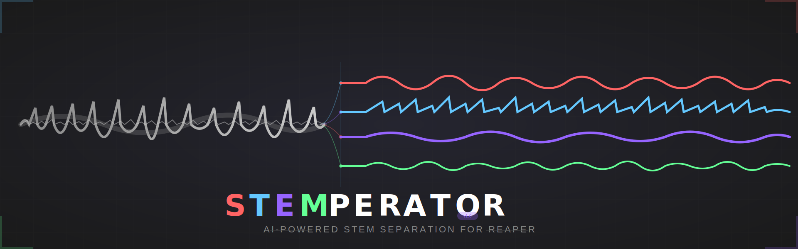
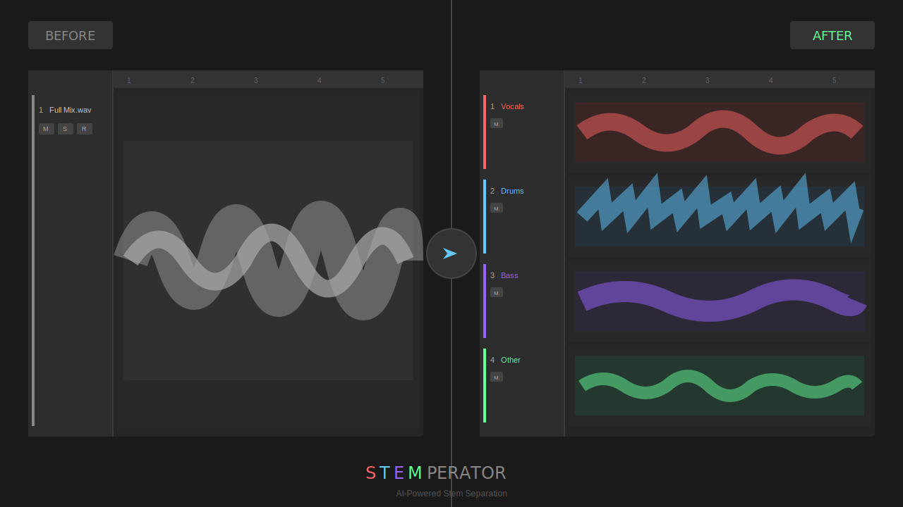
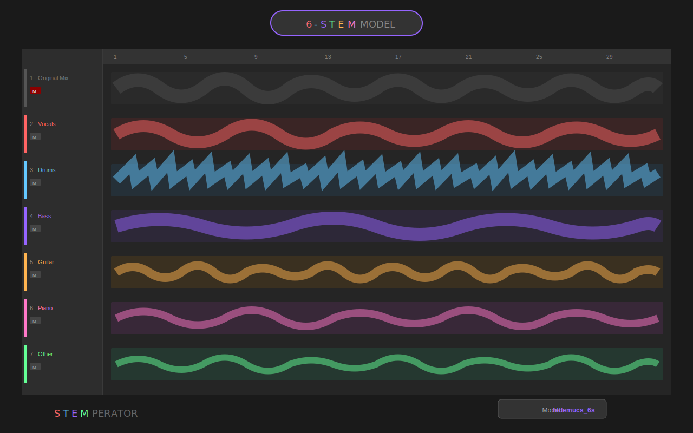
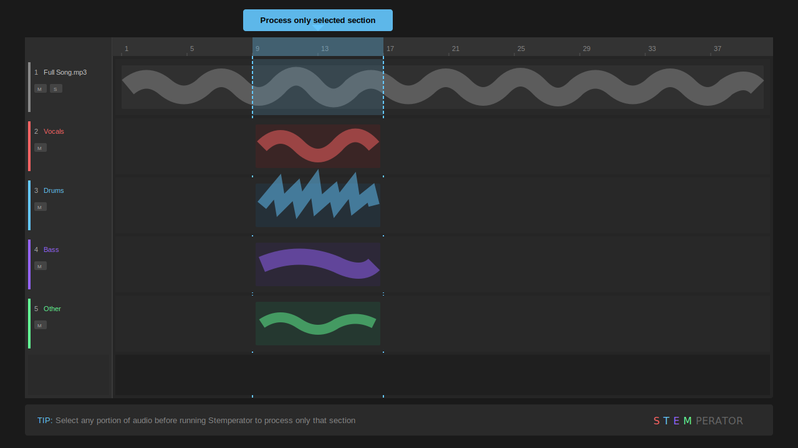
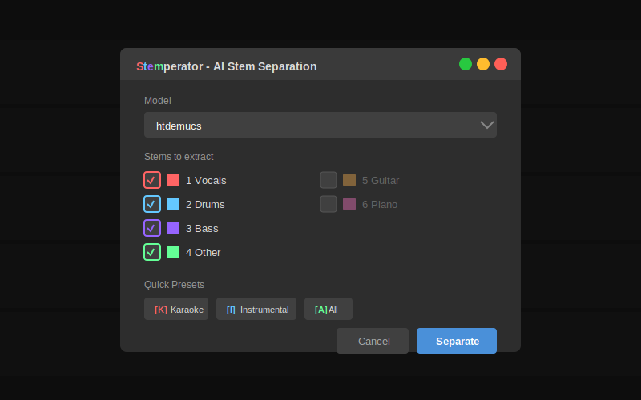
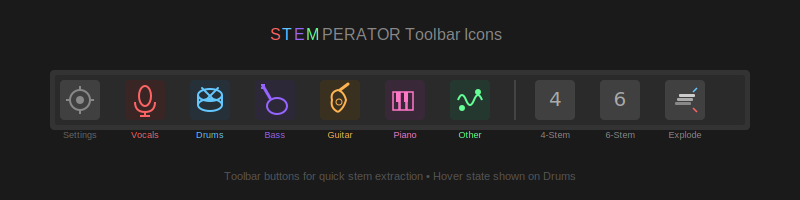
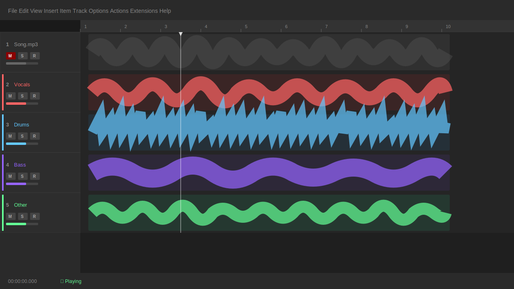

# Stemperator

**AI-powered stem separation for music production**




Stemperator uses AI (Demucs/HTDemucs) to separate audio into individual stems. Available as REAPER scripts (via ReaPack) and as a VST3/Standalone plugin.

---

## Why Stemperator?

**Stay in your DAW.** No more exporting, switching to external tools, and re-importing.



Stemperator integrates directly into REAPER, letting you:

- **Process time selections** - Select a 4-bar section and extract just the drums from that part
- **Edit in place** - Replace a media item with its separated stems instantly
- **Work non-destructively** - Original files are preserved, stems are created alongside
- **Be surgical** - Found a sample with an unwanted vocal bleed? Extract only what you need
- **Stay creative** - Remix, mashup, or repair audio without leaving your project

### Real-World Workflows

| Scenario | Traditional Approach | With Stemperator |
|----------|---------------------|------------------|
| Remove vocal from a loop | Export → External tool → Re-import → Align | Select item → Karaoke → Done |
| Extract drums from reference track | Export → Separate → Import 4 files → Create tracks | Select → All Stems → Auto-routed tracks |
| Fix a sample with unwanted bass | Find alternate sample or EQ compromise | Select → Bass Only → Delete original bass |
| Create acapella from full mix | External software, manual export/import | Select → Vocals Only → New track |
| Isolate guitar solo for analysis | Complex EQ/phase tricks | Select region → Guitar Only |

---

## Quick Start

### REAPER Users (Recommended)

1. **Install AI Backend** (one time, ~5 minutes):

   **Windows** (PowerShell as Admin):
   ```powershell
   # Download and run installer
   Invoke-WebRequest -Uri "https://raw.githubusercontent.com/flarkflarkflark/Stemperator/main/scripts/install.ps1" -OutFile install.ps1
   .\install.ps1
   ```

   **macOS/Linux** (Terminal):
   ```bash
   curl -sSL https://raw.githubusercontent.com/flarkflarkflark/Stemperator/main/scripts/install.sh | bash
   ```

2. **Install REAPER Scripts**:
   - Open REAPER → Extensions → ReaPack → Import repositories
   - Paste: `https://raw.githubusercontent.com/flarkflarkflark/Stemperator/main/scripts/reaper/index.xml`
   - Extensions → ReaPack → Browse packages → Search "Stemperator" → Install

3. **Verify Setup**:
   - Actions → Run: "Stemperator: Setup AI Backend"
   - Should show all green checkmarks ✓

4. **Use It**:
   - Select audio item → Actions → "Stemperator: AI Stem Separation"

---

## Features

### Stem Types

| Model | Stems | Best For |
|-------|-------|----------|
| **htdemucs** (4-stem) | Vocals, Drums, Bass, Other | Fast, general use |
| **htdemucs_ft** (4-stem) | Vocals, Drums, Bass, Other | Highest quality |
| **htdemucs_6s** (6-stem) | Vocals, Drums, Bass, Other, Guitar, Piano | Detailed separation |



### Flexible Input Selection

Stemperator works with whatever you have selected:



| Selection Type | What Gets Processed |
|----------------|---------------------|
| **Media item(s)** | Full item(s) - stems replace or appear alongside original |
| **Time selection** | Only the selected time range - perfect for surgical edits |
| **Time selection + item** | Intersection of both - maximum precision |

This means you can:
- Process an entire song by selecting the media item
- Extract stems from just a chorus by making a time selection
- Work on a specific 2-bar section without affecting the rest

### REAPER Scripts



| Script | Description |
|--------|-------------|
| **Stemperator: AI Stem Separation** | Main dialog - full control over model, stems, and options |
| **Stemperator: Karaoke** | One-click vocal removal (keeps drums, bass, other) |
| **Stemperator: Vocals Only** | Extract vocals to new track |
| **Stemperator: Drums Only** | Extract drums to new track |
| **Stemperator: Bass Only** | Extract bass to new track |
| **Stemperator: All Stems** | Extract all stems to separate tracks |
| **Stemperator: Explode Stems** | Route VST3 multi-outputs to tracks |
| **Stemperator: Setup Toolbar** | Add quick-access toolbar buttons |



### Keyboard Shortcuts (in dialog)
- `1-6` - Toggle stems
- `K` - Karaoke preset
- `I` - Instrumental preset
- `A` - All stems
- `Enter` - Start separation
- `Esc` - Cancel

---

## Installation Details

### Requirements

- **Python 3.9-3.12** (version depends on your GPU):
  - **AMD GPU (Windows)**: Python 3.11 **strongly recommended** (DirectML support)
  - **NVIDIA GPU**: Python 3.10-3.12 recommended
  - **macOS/Linux**: Python 3.10-3.12 recommended
  - **CPU only**: Python 3.10-3.12 recommended
- **ffmpeg** (for audio conversion)
- **~2GB disk space** (for AI models)

> **⚠️ Important**: Python 3.14+ is **NOT COMPATIBLE** with audio-separator and its dependencies (missing pre-built packages). Python 3.13 may have limited support. **Use Python 3.11 for best compatibility and AMD GPU acceleration.**

### Automatic Installation

The install scripts automatically:
1. Find or install Python
2. Create isolated virtual environment
3. Install PyTorch with GPU support (if available)
4. Install audio-separator package
5. Pre-download AI models

### GPU Acceleration

| GPU | Support | Speed Improvement | Requirements |
|-----|---------|-------------------|--------------|
| NVIDIA (CUDA) | ✓ Full | 10-20x faster | Python 3.9-3.12 |
| AMD (DirectML) | ✓ Windows only | 5-10x faster | Python 3.8-3.11 |
| AMD (ROCm) | ✓ Linux only | 10-15x faster | Python 3.9-3.12 |
| Apple Silicon (MPS) | ✓ Native | 5-10x faster | Python 3.9-3.12 |
| Intel/AMD (CPU) | ✓ Fallback | Baseline | Python 3.9+ |

### Manual Installation

If automatic installation fails:

**Windows:**
```cmd
python -m pip install audio-separator[gpu]
winget install Gyan.FFmpeg
```

**macOS:**
```bash
pip3 install audio-separator[gpu]
brew install ffmpeg
```

**Linux (Ubuntu/Debian):**
```bash
pip3 install audio-separator[gpu]
sudo apt install ffmpeg
```

**Linux (Arch):**
```bash
pip install audio-separator[gpu]
sudo pacman -S ffmpeg
```

---

## VST3 Plugin

Stemperator is also available as a multi-output VST3 plugin.

### Download Pre-built

Check [Releases](https://github.com/flarkflarkflark/Stemperator/releases) for pre-built binaries.

### Build from Source

```bash
git clone --recursive https://github.com/flarkflarkflark/Stemperator.git
cd Stemperator

# Install AI backend
./scripts/install.sh

# Build plugin
mkdir build && cd build
cmake ..
cmake --build . --config Release -j8
```

### VST3 Features

- Multi-output routing (4-6 stereo buses)
- Real-time spectral preview
- GPU-accelerated FFT processing
- Premium scalable GUI

---

## Processing Time

| Hardware | 3-minute song |
|----------|---------------|
| RTX 3080 / RX 6800 | 15-30 seconds |
| RTX 2070 / RX 5700 | 30-60 seconds |
| Apple M1/M2 | 45-90 seconds |
| Modern CPU (8 core) | 2-5 minutes |
| Older CPU | 5-15 minutes |

---

## Output



Stems are saved as WAV files alongside your original audio (regardless of input format):
```
mysong.mp3           # Your original file (mp3, wav, flac, etc.)
mysong_vocals.wav    # Stems are always high-quality WAV
mysong_drums.wav
mysong_bass.wav
mysong_other.wav
mysong_guitar.wav    # 6-stem only
mysong_piano.wav     # 6-stem only
```

---

## Troubleshooting

### "Python not found"
Run the install script for your platform, or install Python 3.10+ manually.

### Installation fails with Python 3.14+

**Problem**: `diffq-fixed` or other packages fail to build with "subprocess-exited-with-error"

**Cause**: Python 3.14 is too new - many AI packages don't have pre-built wheels yet

**Solution**: Install Python 3.11 (recommended):
```powershell
winget install Python.Python.3.11
```
Then re-run the installer - it will automatically use Python 3.11.

### "torch-directml" installation failed (AMD GPU on Windows)
This typically means you have Python 3.12+ installed, which is not compatible with DirectML. Install Python 3.11 for AMD GPU support:
```powershell
winget install Python.Python.3.11
```

### "audio-separator not found"
```bash
pip install audio-separator[gpu]
```

### "ffmpeg not found"
- Windows: `winget install Gyan.FFmpeg`
- macOS: `brew install ffmpeg`
- Linux: `sudo apt install ffmpeg` or `sudo pacman -S ffmpeg`

### Slow processing
- Ensure GPU drivers are up to date
- Use `htdemucs` model (faster than `htdemucs_ft`)
- Check GPU is being used (look for CUDA/ROCm/MPS in output)

### Out of memory
- Close other GPU-intensive applications
- Try `htdemucs` instead of `htdemucs_6s`
- Processing in smaller chunks (time selection)

---

## Credits

- **Demucs**: Meta AI Research (MIT License)
- **audio-separator**: Beverly Nguyen (MIT License)
- **JUCE**: RAL/ROLI (Commercial/GPL)

---

## License

MIT License - see [LICENSE](LICENSE)

---

**flarkAUDIO** - Professional Audio Tools
